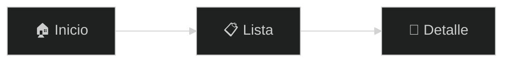

# 📋 Prompt: Generación de Documentación para Aplicaciones Web

## Instrucciones

Cuando el usuario solicite **"genera la documentación"**, **"documenta la app"** o similar, seguir este proceso:

### Paso 1: Analizar la aplicación
1. Revisar `src/App.tsx` para obtener las rutas/páginas
2. Revisar `src/services/` para identificar APIs consumidas
3. Revisar `src/types/` para entender las estructuras de datos
4. Revisar `src/components/Layout.tsx` para entender la navegación
5. Identificar el nombre, descripción y stack de la app

### Paso 2: Generar `docs/DOCUMENTATION.html`

Crear un **único archivo HTML** completo con las siguientes secciones:

---

#### A. Header y Metadata
```html
<!DOCTYPE html>
<html lang="es">
<head>
  <meta charset="UTF-8" />
  <title>[Nombre App] - Documentación Completa</title>
  <meta name="viewport" content="width=device-width,initial-scale=1" />
  <script src="https://cdn.jsdelivr.net/npm/mermaid@10/dist/mermaid.min.js"></script>
</head>
```

#### B. Estilos CSS (Dark Theme del proyecto)
Usar la paleta de colores definida en `copilot-instructions.md`:
```css
:root {
  --bg: #0a0e17;
  --panel: #1c2128;
  --panel-alt: #262d36;
  --text: #f5f7fa;
  --accent: #44FF00;
  --accent-alt: #00B5CC;
  --danger: #ff5f56;
  --success: #3fb950;
  --code-bg: #161b22;
  --border: #30363d;
}
```

#### C. Estructura del Documento (secciones obligatorias)

1. **🏗️ Stack Tecnológico** - Framework, lenguaje, dependencias principales
2. **📋 Tabla de Contenidos** - Links internos a cada sección, navegable
3. **🗺️ Diagrama de Flujo** - Mermaid con flujo completo de navegación
4. **📱 Pantallas** - Una tarjeta por cada vista/página con:
   - ID de sección (ej: `SCREEN-01`)
   - Título de la pantalla
   - Descripción funcional
   - Elementos UI principales
   - Funcionalidades
   - APIs consumidas (con badges clickeables que scrollean a la sección API)
   - Navegaciones posibles (badges verdes)
5. **🔌 API & Servicios** - Para cada endpoint:
   - Método HTTP (GET/POST/etc.) con badge de color
   - URL completa
   - Descripción
   - Parámetros (tabla)
   - Response de ejemplo (con botón copiar)
   - Notas de uso
6. **📊 Tabla de Mapeo** - Pantalla ↔ Endpoints (tabla resumen)

#### D. Diagrama Mermaid


#### E. Tarjeta de Pantalla
```html
<div class="screen-card">
  <div class="screen-content">
    <div class="screen-id">SCREEN-01</div>
    <h3 class="screen-title">Título</h3>
    <p class="screen-desc">Descripción de la funcionalidad.</p>
    <div class="screen-features">
      <strong>Elementos UI:</strong>
      <ul><li>Componente X</li></ul>
      <strong>Funcionalidades:</strong>
      <ul><li>Funcionalidad Y</li></ul>
    </div>
    <div class="screen-actions">
      <span class="action-badge"><a href="#api-endpoint">GET /endpoint</a></span>
      <span class="action-badge nav">→ Pantalla Destino</span>
    </div>
  </div>
</div>
```

#### F. Tarjeta de Endpoint API
```html
<div class="endpoint-card" id="api-endpoint">
  <div class="endpoint-header">
    <span class="method GET">GET</span>
    <span class="endpoint-path">/api/resource</span>
  </div>
  <p>Descripción del endpoint.</p>
  <h4>Parámetros</h4>
  <table>...</table>
  <h4>Respuesta de Ejemplo</h4>
  <pre class="copyable">{...}</pre>
</div>
```

#### G. Funcionalidades JavaScript requeridas:
- **Navegación por TOC**: Scroll suave a secciones
- **Botón copiar**: En bloques de código
- **Filtro/búsqueda**: En la tabla de contenidos
- **Mermaid render**: Inicializar mermaid en DOMContentLoaded

---

### Convenciones de IDs:
- Pantallas: `screen-nombre` (ej: `screen-home`, `screen-characters`)
- Endpoints: `api-recurso-metodo` (ej: `api-characters-get`, `api-character-detail`)
- Secciones: `section-nombre` (ej: `section-stack`, `section-flow`)

### Clases CSS de métodos HTTP:
```css
.GET { background: #4493f8; }
.POST { background: #3fb950; }
.DELETE { background: #ff5f56; }
.PATCH { background: #ffa657; }
.PUT { background: #b48cf2; }
```

### Badges:
```css
.action-badge { background: var(--accent); color: #fff; font-size: .65rem; }
.action-badge.nav { background: var(--success); }
.action-badge a { color: #fff; text-decoration: none; }
```

---

## Validación Final

Antes de entregar, verificar:
- [ ] HTML válido y completo
- [ ] Mermaid diagram renderiza correctamente
- [ ] TOC con links funcionales
- [ ] Todas las pantallas documentadas
- [ ] Todos los endpoints documentados  
- [ ] Badges de API enlazan a las secciones correctas
- [ ] Botones de copiar funcionan
- [ ] Responsive design
- [ ] Dark theme aplicado consistentemente
- [ ] Textos en español
